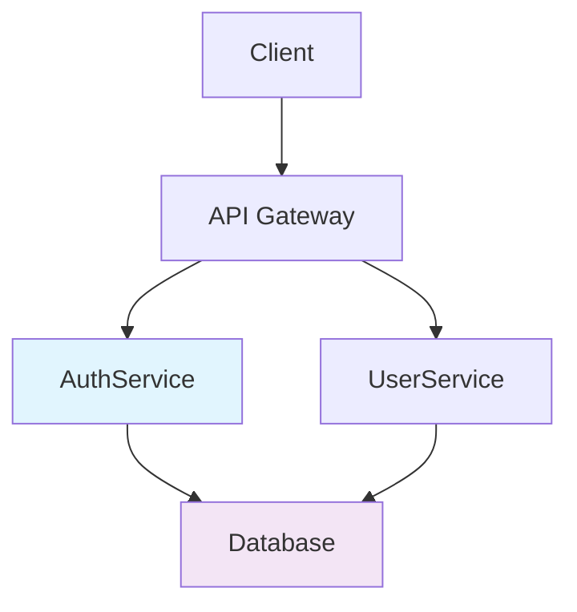
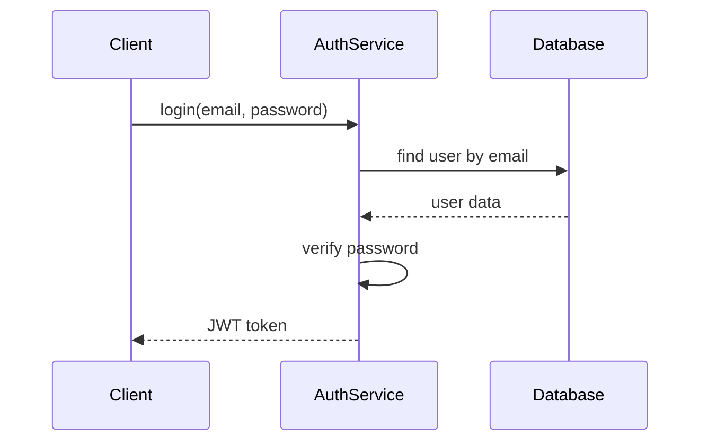

# Agent: update-architecture

Self-contained agent for synchronizing architecture documentation.

## Purpose

Update architecture documentation to reflect changes made during RPI workflow phases.

## Input

- `workItem` - Name of completed work item
- `phaseSummaries` - Array of summaries from RED/GREEN/REFACTOR phases
- `researchFile` - Path to original research file

## Output

Returns object with:
- `docsUpdated` - Array of updated documentation files
- `systemsAdded` - Array of new systems/components added
- `systemsModified` - Array of existing systems modified
- `commitHash` - Git commit hash for documentation update
- `summary` - Brief summary of architecture updates

## Process

1. **Load Implementation Context**
   - Read research file for original requirements
   - Load phase summaries to understand what was implemented
   - Scan modified files from git diff

2. **Analyze Changes**
   - Identify new components/services added
   - Find modified API endpoints
   - Detect database schema changes
   - Note configuration changes

3. **Update Architecture Docs**
   - Update System Architecture diagram
   - Add new components to component catalog
   - Update API documentation
   - Document new database schemas
   - Update deployment configuration

4. **Verify Documentation**
   - Ensure docs match actual implementation
   - Check for consistency across files
   - Validate diagrams are up-to-date

5. **Commit Documentation**
   - Call internal `git-commit` agent
   - Create conventional commit: "docs(feature): update architecture"
   - Include summary of all documentation changes

## Documentation Files to Update

### 1. architecture/system-overview.md
```markdown
# System Architecture

## Components
- **AuthService** - Handles authentication and JWT tokens (NEW)
- **UserService** - Manages user data (MODIFIED)

## Data Flow
User → AuthService → Database → JWT Token
```

### 2. architecture/api/endpoints.md
```markdown
# API Endpoints

## Authentication
- POST /auth/login - User login (NEW)
- POST /auth/logout - User logout (NEW)
- POST /auth/refresh - Refresh JWT token (NEW)

## Request/Response Examples
```

### 3. architecture/database/schema.md
```markdown
# Database Schema

## Users Table
- id: UUID (PRIMARY KEY)
- email: VARCHAR(255) (UNIQUE)
- password_hash: VARCHAR(255) (NEW)
- created_at: TIMESTAMP
- updated_at: TIMESTAMP
```

### 4. architecture/components/catalog.md
```markdown
# Component Catalog

## AuthService
**Purpose**: Authentication logic
**Dependencies**: bcrypt, jsonwebtoken
**API**: login(), logout(), refresh()
**Tests**: 12 tests, 100% coverage
```

## Token Budget

- Input: ~11k tokens (work item + summaries)
- Output: ~1k token summary
- Generated docs: Variable length

## Quality Criteria

1. **Accuracy** - Docs reflect actual implementation
2. **Completeness** - All changes documented
3. **Consistency** - Docs are consistent with each other
4. **Clarity** - Easy to understand for new developers
5. **Up-to-date** - No outdated information

## Diagram Updates

### System Architecture (Mermaid)


### Component Interaction


## Example Output

```json
{
  "docsUpdated": [
    "architecture/system-overview.md",
    "architecture/api/endpoints.md",
    "architecture/database/schema.md",
    "architecture/components/catalog.md",
    "README.md"
  ],
  "systemsAdded": [
    "AuthService - JWT-based authentication",
    "AuthMiddleware - Request authentication",
    "JWT utilities - Token generation/validation"
  ],
  "systemsModified": [
    "API Gateway - Added auth routes",
    "Database Schema - Added password hash column",
    "User Model - Added auth methods"
  ],
  "commitHash": "d4e5f6a7b8c9",
  "summary": "Updated architecture documentation for authentication system including system overview, API endpoints, database schema, and component catalog. Added Mermaid diagrams for visual reference."
}
```

## Documentation Standards

### File Organization
- Use clear, descriptive file names
- Follow consistent directory structure
- Include table of contents in long docs
- Use proper markdown formatting

### Content Guidelines
- Start with purpose statement
- Include examples for each component
- Document dependencies and integrations
- Note security considerations
- Include troubleshooting tips

### Visual Documentation
- Use Mermaid for diagrams
- Include architecture decision records (ADRs)
- Add code snippets for examples
- Use consistent styling

## Integration

- Called after all RPI phases complete
- Receives context from all phases
- Final commit in the 4-commit cycle
- Docs serve as source of truth for future work